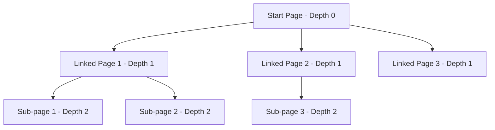
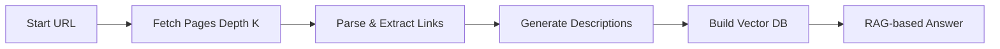

## Overview

DepthSearchGraph is a sophisticated web crawler that scrapes websites by following internal links up to a specified depth. It combines web crawling with RAG (Retrieval-Augmented Generation) for intelligent information extraction.

## Features

- Recursive web crawling with configurable depth
- Automatic link discovery and following
- Option to restrict to internal links only
- RAG-based information retrieval
- Automatic page description generation
- Vector database for efficient search
- Cache support for faster re-runs

## Parameters

The DepthSearchGraph constructor accepts the following parameters:

```python
DepthSearchGraph(
    prompt: str,              # Natural language query for information extraction
    source: str,              # Starting URL or local directory
    config: dict,             # Configuration dictionary
    schema: Optional[BaseModel] = None  # Pydantic schema for structured output
)
```

### Configuration Options

| Parameter | Type | Default | Description |
|-----------|------|---------|-------------|
| `llm` | dict | Required | LLM model configuration |
| `embedder_model` | dict | Optional | Embedding model for RAG |
| `depth` | int | `1` | Maximum crawl depth (0 = single page) |
| `only_inside_links` | bool | `False` | Only follow internal links |
| `verbose` | bool | `False` | Enable detailed logging |
| `headless` | bool | `True` | Run browser in headless mode |
| `cache_path` | str | Optional | Path for caching page descriptions |
| `force` | bool | `False` | Force fetch even with cache |
| `cut` | bool | `True` | Cut content to model token limit |

## Usage Examples

<Tabs>
  <Tab title="OpenAI">
    ```python
    import os
    from dotenv import load_dotenv
    from scrapegraphai.graphs import DepthSearchGraph

    load_dotenv()

    openai_key = os.getenv("OPENAI_API_KEY")

    graph_config = {
        "llm": {
            "api_key": openai_key,
            "model": "openai/gpt-4o-mini",
        },
        "verbose": True,
        "headless": False,
        "depth": 2,
        "only_inside_links": False,
    }

    # Create the DepthSearchGraph instance
    search_graph = DepthSearchGraph(
        prompt="List me all the projects with their description",
        source="https://perinim.github.io",
        config=graph_config,
    )

    # Run the graph
    result = search_graph.run()
    print(result)
    ```
  </Tab>
  <Tab title="Ollama">
    ```python
    import os
    from dotenv import load_dotenv
    from scrapegraphai.graphs import DepthSearchGraph

    load_dotenv()

    graph_config = {
        "llm": {
            "model": "ollama/llama3.1",
            "temperature": 0,
            "format": "json",
            "base_url": "http://localhost:11434",
        },
        "verbose": True,
        "headless": False,
        "depth": 2,
        "only_inside_links": False,
    }

    # Create the DepthSearchGraph instance
    search_graph = DepthSearchGraph(
        prompt="List me all the projects with their description",
        source="https://perinim.github.io",
        config=graph_config,
    )

    # Run the graph
    result = search_graph.run()
    print(result)
    ```
  </Tab>
</Tabs>

## Understanding Depth

The `depth` parameter controls how deep the crawler goes:

| Depth | Pages Crawled | Description |
|-------|---------------|-------------|
| `0` | 1 page | Only the starting URL |
| `1` | 1 + linked pages | Starting URL + all linked pages |
| `2` | 1 + linked + their links | Two levels of links |
| `n` | Recursive | N levels deep |



## Internal vs External Links

### Only Internal Links

Stay within the same domain:

```python
graph_config = {
    "llm": {"model": "openai/gpt-4o-mini"},
    "depth": 3,
    "only_inside_links": True,  # Only follow example.com/* links
}

search_graph = DepthSearchGraph(
    prompt="Extract all product information",
    source="https://example.com/products",
    config=graph_config,
)
```

### Allow External Links

Follow all links including external domains:

```python
graph_config = {
    "llm": {"model": "openai/gpt-4o-mini"},
    "depth": 2,
    "only_inside_links": False,  # Follow all links
}
```

<Warning>
  Setting `only_inside_links=False` with high depth can result in crawling thousands of pages. Always use with caution!
</Warning>

## Caching for Performance

Enable caching to speed up repeated crawls:

```python
import os

graph_config = {
    "llm": {"model": "openai/gpt-4o-mini"},
    "depth": 2,
    "cache_path": os.path.join(os.getcwd(), "cache"),  # Cache directory
    "verbose": True,
}

search_graph = DepthSearchGraph(
    prompt="Find all documentation pages",
    source="https://docs.example.com",
    config=graph_config,
)

result = search_graph.run()
# Subsequent runs will use cached page descriptions
```

## How It Works

1. **Fetch Level K**: Downloads pages at the current depth level
2. **Parse**: Extracts text and discovers links
3. **Describe**: Generates descriptions for each page using LLM
4. **RAG**: Creates vector database from all page contents
5. **Generate**: Answers prompt using RAG retrieval



## Real-World Examples

### Documentation Crawler

```python
from pydantic import BaseModel
from typing import List

class DocPage(BaseModel):
    title: str
    url: str
    content: str
    topics: List[str]

class Documentation(BaseModel):
    pages: List[DocPage]
    total_pages: int

graph_config = {
    "llm": {
        "model": "openai/gpt-4o",
        "api_key": os.getenv("OPENAI_API_KEY"),
    },
    "depth": 3,
    "only_inside_links": True,
    "cache_path": "./doc_cache",
    "verbose": True,
}

search_graph = DepthSearchGraph(
    prompt="Extract all API documentation pages with their endpoints and descriptions",
    source="https://api.example.com/docs",
    config=graph_config,
    schema=Documentation
)

result = search_graph.run()
print(f"Found {result['total_pages']} documentation pages")
```

### E-commerce Site Mapping

```python
from pydantic import BaseModel
from typing import List

class Product(BaseModel):
    name: str
    category: str
    price: float
    url: str

class ProductCatalog(BaseModel):
    products: List[Product]
    categories: List[str]

graph_config = {
    "llm": {
        "model": "openai/gpt-4o",
        "api_key": os.getenv("OPENAI_API_KEY"),
    },
    "depth": 2,
    "only_inside_links": True,
    "verbose": True,
}

search_graph = DepthSearchGraph(
    prompt="Find all products with their names, categories, and prices",
    source="https://shop.example.com/products",
    config=graph_config,
    schema=ProductCatalog
)

result = search_graph.run()
print(f"Found {len(result['products'])} products in {len(result['categories'])} categories")
```

### Blog Content Aggregation

```python
graph_config = {
    "llm": {
        "model": "openai/gpt-4o-mini",
        "api_key": os.getenv("OPENAI_API_KEY"),
    },
    "depth": 2,
    "only_inside_links": True,
    "cache_path": "./blog_cache",
}

search_graph = DepthSearchGraph(
    prompt="Extract all blog posts with titles, dates, authors, and summaries",
    source="https://blog.example.com",
    config=graph_config,
)

result = search_graph.run()
```

## RAG-Based Retrieval

DepthSearchGraph uses RAG to efficiently search through all crawled pages:

1. **Embedding**: Each page is embedded using the embedder model
2. **Vector DB**: All embeddings are stored in a vector database
3. **Retrieval**: When answering, relevant pages are retrieved first
4. **Generation**: LLM generates answer from retrieved content

```python
graph_config = {
    "llm": {"model": "openai/gpt-4o"},
    "embedder_model": {
        "model": "openai/text-embedding-3-small",
        "api_key": os.getenv("OPENAI_API_KEY"),
    },
    "depth": 3,
}
```

## Output Format

The `run()` method returns extracted information:

```python
result = search_graph.run()
# Returns: Dictionary with information gathered from all crawled pages
# or schema-validated object if schema provided
```

## Performance Tips

<Note>
  **Optimize Crawling:**
  - Start with `depth=1` and increase gradually
  - Always use `only_inside_links=True` for site-specific crawls
  - Enable `cache_path` for repeated crawls
  - Use `verbose=True` to monitor progress
  - Set `cut=True` to handle large pages
</Note>

<Warning>
  **Performance Impact:**
  - Depth 2 can crawl 100+ pages
  - Depth 3 can crawl 1000+ pages
  - Each page requires LLM call for description
  - Higher depth = exponentially more pages and time
</Warning>

## Depth Calculation Example

Assuming 10 links per page:

| Depth | Estimated Pages | Estimated Time |
|-------|----------------|----------------|
| 0 | 1 | 5 seconds |
| 1 | 11 (1 + 10) | 30 seconds |
| 2 | 111 (1 + 10 + 100) | 5 minutes |
| 3 | 1,111 (1 + 10 + 100 + 1000) | 30+ minutes |

## Error Handling

```python
try:
    result = search_graph.run()
    if result:
        print("Crawling successful!")
        print(f"Result: {result}")
    else:
        print("No data extracted")
except Exception as e:
    print(f"Error during crawling: {e}")
```

## Local Directories

Crawl local HTML directories:

```python
search_graph = DepthSearchGraph(
    prompt="Extract all information from local HTML files",
    source="/path/to/html/directory",
    config=graph_config,
)

result = search_graph.run()
```

## Use Cases

- **Documentation Scraping**: Extract comprehensive documentation
- **Site Mapping**: Discover and map entire website structure
- **Content Auditing**: Find all content on a website
- **Competitive Analysis**: Analyze competitor websites
- **Archive Creation**: Create searchable archives of websites
- **Knowledge Base**: Build knowledge bases from documentation sites

## Comparison with Other Graphs

| Feature | DepthSearchGraph | SmartScraperGraph | SearchGraph |
|---------|------------------|-------------------|-------------|
| Input | Single URL | Single URL | Search query |
| Crawling | Recursive | None | None |
| Link Following | Yes | No | No |
| Depth Control | Yes | No | No |
| RAG | Yes | No | No |
| Best For | Site-wide scraping | Single page | Web search |

## Related Graphs

<CardGroup cols={2}>
  <Card title="SmartScraperGraph" icon="brain" href="/graphs/smart-scraper">
    Single page scraping
  </Card>
  <Card title="SmartScraperMultiGraph" icon="layer-group" href="/graphs/multi-scraper">
    Multiple known URLs
  </Card>
  <Card title="SearchGraph" icon="magnifying-glass" href="/graphs/search-graph">
    Search-based scraping
  </Card>
</CardGroup>