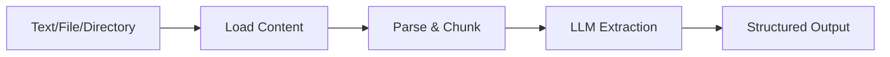

## Overview

DocumentScraperGraph is specialized for extracting information from plain text documents and markdown files. Unlike SmartScraperGraph which handles HTML, this graph processes raw text content efficiently.

## Features

- Extract structured data from plain text and markdown
- No HTML parsing overhead
- Efficient text chunking for large documents
- Schema-based output for structured data
- Supports both single files and directories

## Parameters

The DocumentScraperGraph constructor accepts the following parameters:

```python
DocumentScraperGraph(
    prompt: str,              # Natural language description of what to extract
    source: str,              # Text content, .md file path, or directory
    config: dict,             # Configuration dictionary
    schema: Optional[BaseModel] = None  # Pydantic schema for structured output
)
```

### Configuration Options

| Parameter | Type | Default | Description |
|-----------|------|---------|-------------|
| `llm` | dict | Required | LLM model configuration |
| `verbose` | bool | `False` | Enable detailed logging |
| `additional_info` | str | Optional | Additional context for the LLM |
| `loader_kwargs` | dict | `{}` | Additional arguments for document loading |

## Usage Examples

<Tabs>
  <Tab title="OpenAI">
    ```python
    import os
    import json
    from dotenv import load_dotenv
    from scrapegraphai.graphs import DocumentScraperGraph

    load_dotenv()

    openai_key = os.getenv("OPENAI_API_KEY")

    graph_config = {
        "llm": {
            "api_key": openai_key,
            "model": "openai/gpt-4o",
        }
    }

    # Example: Direct text input
    source = """
        The Divine Comedy, Italian La Divina Commedia, original name La commedia, 
        long narrative poem written in Italian circa 1308/21 by Dante. It is usually 
        held to be one of the world's great works of literature. Divided into three 
        major sections—Inferno, Purgatorio, and Paradiso—the narrative traces the 
        journey of Dante from darkness and error to the revelation of the divine light, 
        culminating in the Beatific Vision of God. Dante is guided by the Roman poet 
        Virgil, who represents the epitome of human knowledge, from the dark wood 
        through the descending circles of the pit of Hell (Inferno). He then climbs 
        the mountain of Purgatory, guided by the Roman poet Statius, who represents 
        the fulfilment of human knowledge, and is finally led by his lifelong love, 
        the Beatrice of his earlier poetry, through the celestial spheres of Paradise.
    """

    document_scraper = DocumentScraperGraph(
        prompt="Summarize the text and find the main topics",
        source=source,
        config=graph_config,
    )

    result = document_scraper.run()
    print(json.dumps(result, indent=4))
    ```
  </Tab>
  <Tab title="Ollama">
    ```python
    import json
    from scrapegraphai.graphs import DocumentScraperGraph

    # Define the configuration for local Ollama
    graph_config = {
        "llm": {
            "model": "ollama/llama3",
            "temperature": 0,
            "format": "json",
            "model_tokens": 4000,
        },
        "verbose": True,
        "headless": False,
    }

    source = """
        The Divine Comedy, Italian La Divina Commedia, original name La commedia, 
        long narrative poem written in Italian circa 1308/21 by Dante. It is usually 
        held to be one of the world's great works of literature. Divided into three 
        major sections—Inferno, Purgatorio, and Paradiso—the narrative traces the 
        journey of Dante from darkness and error to the revelation of the divine light, 
        culminating in the Beatific Vision of God.
    """

    document_scraper = DocumentScraperGraph(
        prompt="Summarize the text and find the main topics",
        source=source,
        config=graph_config,
    )

    result = document_scraper.run()
    print(json.dumps(result, indent=4))
    ```
  </Tab>
</Tabs>

## Input Types

### Direct Text

Pass text content directly as a string:

```python
text_content = """
Your document content here.
Can span multiple lines.
"""

document_scraper = DocumentScraperGraph(
    prompt="Extract key information",
    source=text_content,
    config=graph_config,
)
```

### Markdown File

Process a single markdown file:

```python
document_scraper = DocumentScraperGraph(
    prompt="Summarize the documentation",
    source="/path/to/document.md",
    config=graph_config,
)
```

### Directory of Files

Process all markdown files in a directory:

```python
document_scraper = DocumentScraperGraph(
    prompt="Extract all code examples",
    source="/path/to/docs/directory/",
    config=graph_config,
)
```

## Schema-Based Extraction

Use Pydantic schemas for structured output:

```python
from pydantic import BaseModel, Field
from typing import List

class Topic(BaseModel):
    name: str = Field(description="Topic name")
    description: str = Field(description="Topic description")

class DocumentSummary(BaseModel):
    title: str = Field(description="Document title")
    main_topics: List[Topic] = Field(description="Main topics discussed")
    key_takeaways: List[str] = Field(description="Key takeaways")

graph_config = {
    "llm": {
        "model": "openai/gpt-4o",
        "api_key": os.getenv("OPENAI_API_KEY"),
    },
}

document_scraper = DocumentScraperGraph(
    prompt="Analyze this document",
    source=document_text,
    config=graph_config,
    schema=DocumentSummary
)

result = document_scraper.run()
# Returns structured DocumentSummary object
```

## Advanced Examples

### Extract Code Snippets

```python
from pydantic import BaseModel
from typing import List

class CodeSnippet(BaseModel):
    language: str
    code: str
    description: str

class CodeExamples(BaseModel):
    snippets: List[CodeSnippet]

document_scraper = DocumentScraperGraph(
    prompt="Extract all code examples with their programming language and description",
    source="/path/to/technical/doc.md",
    config=graph_config,
    schema=CodeExamples
)

result = document_scraper.run()
for snippet in result['snippets']:
    print(f"Language: {snippet['language']}")
    print(f"Code: {snippet['code']}")
```

### Research Paper Analysis

```python
from pydantic import BaseModel
from typing import List

class ResearchPaper(BaseModel):
    title: str
    authors: List[str]
    abstract: str
    methodology: str
    key_findings: List[str]
    conclusions: str

paper_text = """
[Your research paper text here]
"""

document_scraper = DocumentScraperGraph(
    prompt="Analyze this research paper and extract structured information",
    source=paper_text,
    config=graph_config,
    schema=ResearchPaper
)

result = document_scraper.run()
```

### Meeting Notes Extraction

```python
from pydantic import BaseModel
from typing import List

class MeetingNotes(BaseModel):
    date: str
    attendees: List[str]
    topics_discussed: List[str]
    action_items: List[str]
    decisions_made: List[str]

meeting_notes = """
[Your meeting notes here]
"""

document_scraper = DocumentScraperGraph(
    prompt="Extract meeting information including attendees, topics, and action items",
    source=meeting_notes,
    config=graph_config,
    schema=MeetingNotes
)

result = document_scraper.run()
```

## How It Works

1. **Fetch**: Loads text content from string, file, or directory
2. **Parse**: Chunks text without HTML parsing (more efficient)
3. **Generate**: Extracts information based on your prompt



## Performance Benefits

DocumentScraperGraph is optimized for text:

| Feature | DocumentScraperGraph | SmartScraperGraph |
|---------|---------------------|-------------------|
| HTML Parsing | ❌ No | ✅ Yes |
| Browser Loading | ❌ No | ✅ Yes |
| Speed | ⚡ Faster | 🐌 Slower |
| Best For | Text/Markdown | HTML/Web pages |

<Note>
  Use DocumentScraperGraph for pure text content to avoid unnecessary HTML parsing overhead.
</Note>

## Output Format

The `run()` method returns extracted data:

```python
result = document_scraper.run()
# Returns: Dictionary with extracted information
# or schema-validated object if schema provided
```

## Use Cases

- **Documentation Analysis**: Extract information from technical documentation
- **Research**: Analyze research papers and extract key findings
- **Meeting Notes**: Structure unstructured meeting notes
- **Content Summarization**: Summarize long-form text content
- **Code Documentation**: Extract code examples from documentation
- **Legal Documents**: Extract clauses and key terms
- **Academic Papers**: Structure abstracts, methodologies, and conclusions

## Processing Multiple Documents

```python
import os
from pathlib import Path

# Process all markdown files in a directory
docs_dir = "/path/to/documentation/"

document_scraper = DocumentScraperGraph(
    prompt="Extract all API endpoints and their descriptions",
    source=docs_dir,
    config=graph_config,
)

result = document_scraper.run()
```

## Error Handling

```python
try:
    result = document_scraper.run()
    if result:
        print("Extraction successful:", result)
    else:
        print("No information extracted")
except FileNotFoundError:
    print("Document file not found")
except Exception as e:
    print(f"Error during extraction: {e}")
```

## Performance Tips

<Note>
  - DocumentScraperGraph is faster than SmartScraperGraph for text content
  - No browser overhead or HTML parsing
  - Use `model_tokens` to control chunk size for large documents
  - Provide specific prompts for better extraction accuracy
</Note>

## Related Graphs

<CardGroup cols={2}>
  <Card title="SmartScraperGraph" icon="brain" href="/graphs/smart-scraper">
    For HTML/web page scraping
  </Card>
  <Card title="ScriptCreatorGraph" icon="code" href="/graphs/script-creator">
    Generate scraping scripts
  </Card>
</CardGroup>