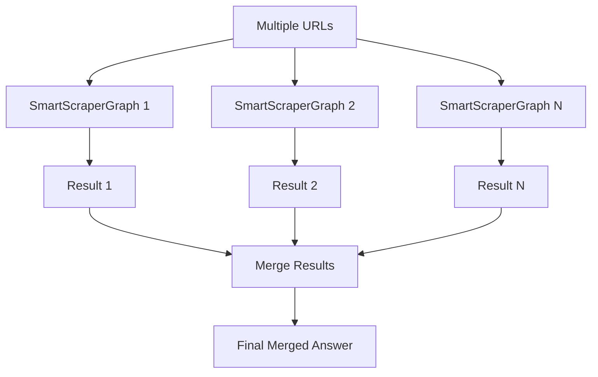

## Overview

SmartScraperMultiGraph is a powerful scraping pipeline that scrapes multiple URLs simultaneously and merges the extracted information into a comprehensive answer. It's perfect for gathering data from multiple known sources.

## Features

- Scrape multiple URLs with a single prompt
- Automatic result merging using LLM
- Parallel processing for better performance
- Schema-based output for structured data
- Consistent extraction across all URLs

## Parameters

The SmartScraperMultiGraph constructor accepts the following parameters:

```python
SmartScraperMultiGraph(
    prompt: str,              # Natural language description of what to extract
    source: List[str],        # List of URLs to scrape
    config: dict,             # Configuration dictionary
    schema: Optional[BaseModel] = None  # Pydantic schema for structured output
)
```

<Note>
  Unlike SmartScraperGraph, the `source` parameter must be a **list of URLs**, not a single URL.
</Note>

### Configuration Options

| Parameter | Type | Default | Description |
|-----------|------|---------|-------------|
| `llm` | dict | Required | LLM model configuration |
| `verbose` | bool | `False` | Enable detailed logging |
| `headless` | bool | `True` | Run browser in headless mode |
| `max_results` | int | `3` | Maximum number of URLs to process |

## Usage Examples

<Tabs>
  <Tab title="OpenAI">
    ```python
    import os
    import json
    from dotenv import load_dotenv
    from scrapegraphai.graphs import SmartScraperMultiGraph

    load_dotenv()

    openai_key = os.getenv("OPENAI_API_KEY")

    graph_config = {
        "llm": {
            "api_key": openai_key,
            "model": "openai/gpt-4o",
        },
        "verbose": True,
        "headless": False,
    }

    # Create the SmartScraperMultiGraph instance
    multi_scraper = SmartScraperMultiGraph(
        prompt="Who is ?",
        source=[
            "https://perinim.github.io/",
            "https://perinim.github.io/cv/"
        ],
        config=graph_config,
    )

    # Run the graph
    result = multi_scraper.run()
    print(json.dumps(result, indent=4))
    ```
  </Tab>
  <Tab title="Ollama">
    ```python
    import json
    from scrapegraphai.graphs import SmartScraperMultiGraph
    from scrapegraphai.utils import prettify_exec_info

    # Define the configuration for local Ollama
    graph_config = {
        "llm": {
            "model": "ollama/llama3.2",
            "temperature": 0,
            "base_url": "http://localhost:11434",
        },
        "verbose": True,
        "headless": False,
    }

    # Create the SmartScraperMultiGraph instance
    multi_scraper = SmartScraperMultiGraph(
        prompt="Extract information about the person",
        source=[
            "https://example.com/about",
            "https://example.com/bio",
            "https://example.com/resume"
        ],
        config=graph_config,
    )

    # Run the graph
    result = multi_scraper.run()
    print(json.dumps(result, indent=4))

    # Get execution info
    graph_exec_info = multi_scraper.get_execution_info()
    print(prettify_exec_info(graph_exec_info))
    ```
  </Tab>
</Tabs>

## How It Works

1. **Iterate**: Each URL is scraped individually using SmartScraperGraph
2. **Extract**: Data is extracted from each page using the same prompt
3. **Merge**: All results are intelligently merged by the LLM



## Schema-Based Extraction

Use Pydantic schemas to ensure consistent structure across all sources:

```python
from pydantic import BaseModel, Field
from typing import List

class Person(BaseModel):
    name: str = Field(description="Full name")
    role: str = Field(description="Professional role")
    skills: List[str] = Field(description="List of skills")
    experience: str = Field(description="Work experience summary")

graph_config = {
    "llm": {
        "model": "openai/gpt-4o",
        "api_key": os.getenv("OPENAI_API_KEY"),
    },
}

multi_scraper = SmartScraperMultiGraph(
    prompt="Extract comprehensive information about this person",
    source=[
        "https://example.com/profile",
        "https://example.com/about",
        "https://example.com/portfolio"
    ],
    config=graph_config,
    schema=Person
)

result = multi_scraper.run()
print(f"Name: {result['name']}")
print(f"Role: {result['role']}")
print(f"Skills: {', '.join(result['skills'])}")
```

## Real-World Examples

### E-commerce Price Comparison

```python
from pydantic import BaseModel
from typing import List

class Product(BaseModel):
    name: str
    prices: List[dict]  # [{"store": "Store A", "price": 99.99}, ...]
    average_price: float
    lowest_price: float
    highest_price: float

multi_scraper = SmartScraperMultiGraph(
    prompt="Extract the price for iPhone 15 Pro",
    source=[
        "https://www.amazon.com/iphone-15-pro",
        "https://www.bestbuy.com/iphone-15-pro",
        "https://www.apple.com/iphone-15-pro"
    ],
    config=graph_config,
    schema=Product
)

result = multi_scraper.run()
print(f"Average Price: ${result['average_price']}")
print(f"Best Deal: ${result['lowest_price']}")
```

### News Aggregation

```python
from pydantic import BaseModel
from typing import List

class NewsArticle(BaseModel):
    title: str
    source: str
    summary: str
    publish_date: str

class NewsAggregation(BaseModel):
    topic: str
    articles: List[NewsArticle]
    common_themes: List[str]

multi_scraper = SmartScraperMultiGraph(
    prompt="Extract news articles about AI advancements",
    source=[
        "https://techcrunch.com/ai",
        "https://www.wired.com/tag/artificial-intelligence",
        "https://www.theverge.com/ai-artificial-intelligence"
    ],
    config=graph_config,
    schema=NewsAggregation
)

result = multi_scraper.run()
print(f"Found {len(result['articles'])} articles")
print(f"Common themes: {', '.join(result['common_themes'])}")
```

### Company Research

```python
from pydantic import BaseModel
from typing import List, Optional

class Company(BaseModel):
    name: str
    description: str
    products: List[str]
    founders: List[str]
    funding: Optional[str]
    headquarters: str

multi_scraper = SmartScraperMultiGraph(
    prompt="Compile comprehensive company information",
    source=[
        "https://company.com/about",
        "https://company.com/products",
        "https://company.com/team"
    ],
    config=graph_config,
    schema=Company
)

result = multi_scraper.run()
```

## Controlling Number of URLs

Limit the number of URLs to process:

```python
graph_config = {
    "llm": {"model": "openai/gpt-4o"},
    "max_results": 5,  # Process only first 5 URLs
}

multi_scraper = SmartScraperMultiGraph(
    prompt="Extract product information",
    source=[
        "https://site1.com/product",
        "https://site2.com/product",
        "https://site3.com/product",
        "https://site4.com/product",
        "https://site5.com/product",
        "https://site6.com/product",  # Will be skipped
        "https://site7.com/product",  # Will be skipped
    ],
    config=graph_config,
)
```

## Output Format

The `run()` method returns a merged answer:

```python
result = multi_scraper.run()
# Returns: Dictionary with intelligently merged data from all sources
# or schema-validated object if schema provided
```

## SmartScraperMultiGraph vs SearchGraph

| Feature | SmartScraperMultiGraph | SearchGraph |
|---------|------------------------|-------------|
| Input | Known list of URLs | Search query |
| URL Discovery | Manual | Automatic (via search) |
| Processing | All specified URLs | Top N search results |
| Best For | Known sources | Research/discovery |
| Speed | Depends on URL count | Depends on max_results + search |

<Note>
  Use **SmartScraperMultiGraph** when you know the URLs to scrape. Use **SearchGraph** when you need to discover URLs first.
</Note>

## Performance Considerations

<Warning>
  - Each URL is scraped sequentially (not in parallel)
  - Total execution time = (time per URL) × (number of URLs) + merge time
  - Recommended: Keep URL count under 10 for reasonable execution time
  - Use `max_results` to limit processing for large URL lists
</Warning>

## Error Handling

```python
try:
    result = multi_scraper.run()
    if result:
        print("Multi-scraping successful!")
        print(f"Merged data: {result}")
    else:
        print("No data extracted from any source")
except Exception as e:
    print(f"Error during multi-scraping: {e}")
```

## Tips for Best Results

1. **Consistent Prompts**: Use the same prompt for all URLs for better merging
2. **Similar Sources**: Scrape pages with similar structure for consistent data
3. **Schema Usage**: Always use schemas for structured output
4. **URL Quality**: Ensure all URLs are accessible and contain relevant data
5. **Verbose Mode**: Enable during development to monitor per-URL progress

## Example: Product Comparison

```python
from pydantic import BaseModel
from typing import List

class ProductComparison(BaseModel):
    product_name: str
    stores: List[dict]  # [{"store": "...", "price": ..., "availability": ...}]
    best_deal: dict
    features_comparison: dict

multi_scraper = SmartScraperMultiGraph(
    prompt="Compare this product across different stores including price, availability, and features",
    source=[
        "https://store1.com/product-x",
        "https://store2.com/product-x",
        "https://store3.com/product-x",
    ],
    config=graph_config,
    schema=ProductComparison
)

result = multi_scraper.run()
print(f"Product: {result['product_name']}")
print(f"Best deal at: {result['best_deal']['store']} - ${result['best_deal']['price']}")
```

## Merging Strategy

The graph uses intelligent LLM-based merging:

- **Aggregation**: Combines lists and arrays
- **Deduplication**: Removes duplicate information
- **Conflict Resolution**: Chooses most reliable data
- **Summarization**: Creates cohesive narratives from multiple sources

## Related Graphs

<CardGroup cols={2}>
  <Card title="SmartScraperGraph" icon="brain" href="/graphs/smart-scraper">
    Scrape a single URL
  </Card>
  <Card title="SearchGraph" icon="magnifying-glass" href="/graphs/search-graph">
    Search and scrape automatically
  </Card>
  <Card title="DepthSearchGraph" icon="sitemap" href="/graphs/depth-search">
    Crawl entire websites
  </Card>
</CardGroup>