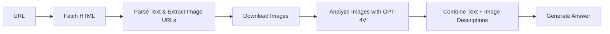

## Overview

OmniScraperGraph is an advanced scraping pipeline that combines text extraction with image analysis. It uses vision-capable LLMs to describe images on the page and incorporates those descriptions into the final answer.

## Features

- Extract both text and visual content from web pages
- Automatic image detection and downloading
- AI-powered image description using GPT-4 Vision
- Configurable maximum number of images to process
- Integrated text + image analysis
- Schema-based structured output

<Warning>
  OmniScraperGraph requires **OpenAI GPT-4 Vision** models (gpt-4o, gpt-4-turbo, etc.). Other LLM providers are not currently supported for image analysis.
</Warning>

## Parameters

The OmniScraperGraph constructor accepts the following parameters:

```python
OmniScraperGraph(
    prompt: str,              # Natural language description including text and image requirements
    source: str,              # URL or path to local HTML file
    config: dict,             # Configuration dictionary
    schema: Optional[BaseModel] = None  # Pydantic schema for structured output
)
```

### Configuration Options

| Parameter | Type | Default | Description |
|-----------|------|---------|-------------|
| `llm` | dict | Required | LLM model configuration (must support vision) |
| `max_images` | int | `5` | Maximum number of images to process |
| `verbose` | bool | `False` | Enable detailed logging |
| `headless` | bool | `True` | Run browser in headless mode |
| `loader_kwargs` | dict | `{}` | Additional arguments for page loading |

## Usage Example

```python
import os
import json
from dotenv import load_dotenv
from scrapegraphai.graphs import OmniScraperGraph
from scrapegraphai.utils import prettify_exec_info

load_dotenv()

openai_key = os.getenv("OPENAI_API_KEY")

graph_config = {
    "llm": {
        "api_key": openai_key,
        "model": "openai/gpt-4o",  # Must be a vision-capable model
    },
    "max_images": 5,
    "verbose": True,
}

# Create the OmniScraperGraph instance
omni_scraper = OmniScraperGraph(
    prompt="List me all the attractions in Chioggia and describe their pictures.",
    source="https://en.wikipedia.org/wiki/Chioggia",
    config=graph_config,
)

# Run the graph
result = omni_scraper.run()
print(json.dumps(result, indent=4))

# Get execution info
graph_exec_info = omni_scraper.get_execution_info()
print(prettify_exec_info(graph_exec_info))
```

## Supported Vision Models

OmniScraperGraph works with OpenAI's vision-capable models:

| Model | Speed | Quality | Cost | Best For |
|-------|-------|---------|------|----------|
| `gpt-4o` | Fast | Excellent | $$ | Production use |
| `gpt-4o-mini` | Fastest | Good | $ | Development/testing |
| `gpt-4-turbo` | Medium | Excellent | $$$ | High accuracy needs |

```python
graph_config = {
    "llm": {
        "api_key": os.getenv("OPENAI_API_KEY"),
        "model": "openai/gpt-4o",  # Recommended
    },
    "max_images": 5,
}
```

## Controlling Image Count

Limit the number of images to analyze for performance:

```python
graph_config = {
    "llm": {
        "api_key": openai_key,
        "model": "openai/gpt-4o",
    },
    "max_images": 10,  # Process up to 10 images
}

omni_scraper = OmniScraperGraph(
    prompt="Describe the product images and their features",
    source="https://example.com/product",
    config=graph_config,
)
```

<Note>
  Each image analysis consumes additional tokens. Higher `max_images` = higher cost and longer execution time.
</Note>

## Schema-Based Extraction

Structure output with text and image descriptions:

```python
from pydantic import BaseModel, Field
from typing import List

class ImageDescription(BaseModel):
    url: str = Field(description="Image URL")
    description: str = Field(description="AI-generated image description")
    alt_text: str = Field(description="Image alt text if available")

class Attraction(BaseModel):
    name: str = Field(description="Attraction name")
    description: str = Field(description="Text description")
    images: List[ImageDescription] = Field(description="Associated images")

class AttractionList(BaseModel):
    attractions: List[Attraction]

graph_config = {
    "llm": {
        "model": "openai/gpt-4o",
        "api_key": os.getenv("OPENAI_API_KEY"),
    },
    "max_images": 8,
}

omni_scraper = OmniScraperGraph(
    prompt="Extract all attractions with their descriptions and images",
    source="https://tourism-site.com/attractions",
    config=graph_config,
    schema=AttractionList
)

result = omni_scraper.run()
for attraction in result['attractions']:
    print(f"{attraction['name']}: {len(attraction['images'])} images")
```

## How It Works

1. **Fetch**: Downloads the web page HTML
2. **Parse**: Extracts text content and discovers image URLs
3. **Image Analysis**: Downloads and analyzes images using GPT-4 Vision
4. **Generate**: Combines text and image descriptions to answer prompt



## Real-World Examples

### E-commerce Product Analysis

```python
from pydantic import BaseModel
from typing import List

class ProductImage(BaseModel):
    description: str
    features_visible: List[str]

class Product(BaseModel):
    name: str
    price: float
    text_description: str
    images: List[ProductImage]
    visual_features: List[str]

graph_config = {
    "llm": {
        "model": "openai/gpt-4o",
        "api_key": os.getenv("OPENAI_API_KEY"),
    },
    "max_images": 6,
}

omni_scraper = OmniScraperGraph(
    prompt="Extract product information including name, price, description, and analyze all product images to identify visible features",
    source="https://shop.example.com/product/12345",
    config=graph_config,
    schema=Product
)

result = omni_scraper.run()
print(f"Product: {result['name']}")
print(f"Visual features found: {', '.join(result['visual_features'])}")
```

### Real Estate Listings

```python
from pydantic import BaseModel
from typing import List

class PropertyImage(BaseModel):
    room_type: str
    description: str
    condition: str

class Property(BaseModel):
    address: str
    price: int
    bedrooms: int
    bathrooms: int
    description: str
    image_analysis: List[PropertyImage]

graph_config = {
    "llm": {
        "model": "openai/gpt-4o",
        "api_key": os.getenv("OPENAI_API_KEY"),
    },
    "max_images": 10,
}

omni_scraper = OmniScraperGraph(
    prompt="Extract property details and analyze images to identify rooms, their condition, and notable features",
    source="https://realestate.com/listing/12345",
    config=graph_config,
    schema=Property
)

result = omni_scraper.run()
```

### Restaurant Menu with Food Images

```python
from pydantic import BaseModel
from typing import List

class DishImage(BaseModel):
    description: str
    visual_appeal: str
    ingredients_visible: List[str]

class Dish(BaseModel):
    name: str
    price: float
    description: str
    image_analysis: DishImage

class Menu(BaseModel):
    restaurant_name: str
    dishes: List[Dish]

omni_scraper = OmniScraperGraph(
    prompt="Extract menu items with prices and analyze food images to describe appearance and visible ingredients",
    source="https://restaurant.com/menu",
    config=graph_config,
    schema=Menu
)

result = omni_scraper.run()
```

### Art Gallery or Museum

```python
from pydantic import BaseModel
from typing import List

class Artwork(BaseModel):
    title: str
    artist: str
    year: str
    description: str
    visual_analysis: str
    style: str
    colors: List[str]
    subject_matter: str

class Exhibition(BaseModel):
    title: str
    artworks: List[Artwork]

graph_config = {
    "llm": {
        "model": "openai/gpt-4o",
        "api_key": os.getenv("OPENAI_API_KEY"),
    },
    "max_images": 15,
}

omni_scraper = OmniScraperGraph(
    prompt="Extract artwork information and provide detailed visual analysis of each piece including style, colors, and subject matter",
    source="https://museum.com/exhibition",
    config=graph_config,
    schema=Exhibition
)

result = omni_scraper.run()
```

## Image Processing Details

### Automatic Image Detection

OmniScraperGraph automatically:
- Finds all `` tags on the page
- Extracts image URLs (both relative and absolute)
- Filters out small icons and UI elements
- Prioritizes content images over decorative ones

### Image Analysis

For each image, the vision model:
- Describes what's visible in the image
- Identifies objects, people, text, and scenes
- Extracts relevant information based on your prompt
- Integrates descriptions with text content

## Output Format

The `run()` method returns combined text and image analysis:

```python
result = omni_scraper.run()
# Returns: Dictionary with both text extraction and image descriptions
# or schema-validated object if schema provided

# Example structure:
# {
#     "title": "Product Name",
#     "description": "Text description from page",
#     "images": [
#         {
#             "url": "https://...",
#             "description": "AI-generated description of what's in the image"
#         }
#     ]
# }
```

## Performance and Costs

<Warning>
  **Cost Considerations:**
  - Text extraction: ~$0.01-0.03 per page
  - Image analysis: ~$0.01-0.05 **per image**
  - Total cost = text cost + (image cost × number of images)
  - Example: 5 images = $0.06-0.28 total cost per page
</Warning>

<Note>
  **Performance Tips:**
  - Use `max_images=3-5` for optimal balance
  - Higher image count = longer execution time
  - GPT-4o is faster than GPT-4-turbo for vision tasks
  - Consider caching for repeated analyses
</Note>

## Error Handling

```python
try:
    result = omni_scraper.run()
    if result:
        print("Scraping successful!")
        print(f"Extracted data: {result}")
    else:
        print("No data extracted")
except Exception as e:
    print(f"Error during omni-scraping: {e}")
```

## Use Cases

- **E-commerce**: Analyze product images for features not mentioned in text
- **Real Estate**: Assess property condition from listing photos
- **Fashion**: Describe clothing items from catalog images
- **Art & Museums**: Analyze and describe artwork
- **Food & Dining**: Describe dishes from restaurant photos
- **Travel**: Analyze destination photos for attractions
- **Social Media**: Extract content from image-heavy posts
- **Accessibility**: Generate image descriptions for visually impaired users

## Comparison with SmartScraperGraph

| Feature | OmniScraperGraph | SmartScraperGraph |
|---------|------------------|-------------------|
| Text Extraction | ✅ Yes | ✅ Yes |
| Image Analysis | ✅ Yes | ❌ No |
| Required Model | GPT-4 Vision | Any LLM |
| Cost per Page | Higher | Lower |
| Use Case | Image-rich content | Text-only content |
| Speed | Slower | Faster |

## Local HTML Files

Analyze local HTML files with images:

```python
omni_scraper = OmniScraperGraph(
    prompt="Analyze all images and text in this local page",
    source="/path/to/local/page.html",
    config=graph_config,
)

result = omni_scraper.run()
```

<Note>
  Local images must be referenced with absolute paths or the HTML file must contain complete image URLs.
</Note>

## Prompt Engineering for Images

Include specific image-related instructions in your prompt:

```python
# Good prompt for image analysis
prompt = """
Extract product information including:
- Product name and price from text
- Visual features visible in images (color, material, design)
- Condition assessment from photos
- Any text visible in product images
"""

# Not as effective
prompt = "Extract product information"
```

## Limitations

- Only supports OpenAI vision models
- Image analysis adds significant cost
- Processing time increases with image count
- Requires high-quality images for best results
- Some complex visual content may be misinterpreted

## Related Graphs

<CardGroup cols={2}>
  <Card title="SmartScraperGraph" icon="brain" href="/graphs/smart-scraper">
    Text-only scraping without image analysis
  </Card>
  <Card title="OmniSearchGraph" icon="magnifying-glass" href="/graphs/search-graph">
    Search and scrape with image analysis
  </Card>
</CardGroup>
