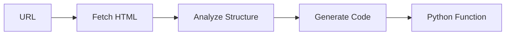

## Overview

ScriptCreatorGraph is a unique graph that generates reusable Python scraping scripts instead of just extracting data. It analyzes a web page and creates a custom `extract_data(html: str) -> dict` function using BeautifulSoup.

## Features

- Generates production-ready Python code
- Uses BeautifulSoup for HTML parsing
- Creates reusable scraping functions
- Analyzes page structure automatically
- Returns complete, executable Python code

## Parameters

The ScriptCreatorGraph constructor accepts the following parameters:

```python
ScriptCreatorGraph(
    prompt: str,              # Description of what data to extract
    source: str,              # URL or path to local HTML file
    config: dict,             # Configuration dictionary (must include 'library')
    schema: Optional[BaseModel] = None  # Pydantic schema for structured output
)
```

### Configuration Options

| Parameter | Type | Default | Description |
|-----------|------|---------|-------------|
| `llm` | dict | Required | LLM model configuration |
| `library` | str | Required | Scraping library ("beautifulsoup") |
| `verbose` | bool | `False` | Enable detailed logging |
| `headless` | bool | `True` | Run browser in headless mode |

<Note>
  The `library` parameter must be set to `"beautifulsoup"` in the config. This is a required field.
</Note>

## Usage Examples

<Tabs>
  <Tab title="OpenAI">
    ```python
    import os
    import json
    from dotenv import load_dotenv
    from scrapegraphai.graphs import ScriptCreatorGraph
    from scrapegraphai.utils import prettify_exec_info

    load_dotenv()

    # Define the configuration
    graph_config = {
        "llm": {
            "api_key": os.getenv("OPENAI_API_KEY"),
            "model": "openai/gpt-4o",
        },
        "library": "beautifulsoup",  # Required!
        "verbose": True,
        "headless": False,
    }

    # Create the ScriptCreatorGraph instance
    script_creator = ScriptCreatorGraph(
        prompt="List me all the news with their description.",
        source="https://perinim.github.io/projects",
        config=graph_config,
    )

    # Run the graph and get the generated code
    result = script_creator.run()
    print(json.dumps(result, indent=4))

    # Get execution info
    graph_exec_info = script_creator.get_execution_info()
    print(prettify_exec_info(graph_exec_info))
    ```
  </Tab>
  <Tab title="Ollama">
    ```python
    from scrapegraphai.graphs import ScriptCreatorGraph
    from scrapegraphai.utils import prettify_exec_info

    # Define the configuration for local Ollama
    graph_config = {
        "llm": {
            "model": "ollama/llama3.1",
            "temperature": 0.5,
            "base_url": "http://localhost:11434",
        },
        "library": "beautifulsoup",  # Required!
        "verbose": True,
    }

    # Create the ScriptCreatorGraph instance
    script_creator = ScriptCreatorGraph(
        prompt="List me all the news with their description.",
        source="https://perinim.github.io/projects",
        config=graph_config,
    )

    # Run the graph
    result = script_creator.run()
    print(result)

    # Get execution info
    graph_exec_info = script_creator.get_execution_info()
    print(prettify_exec_info(graph_exec_info))
    ```
  </Tab>
</Tabs>

## Generated Code Format

The graph generates a complete Python function that you can reuse:

```python
result = script_creator.run()

# Example output:
'''
from bs4 import BeautifulSoup

def extract_data(html: str) -> dict:
    """
    Extract news articles with their descriptions from the HTML.
    
    Args:
        html: Raw HTML string of the page
    
    Returns:
        Dictionary containing extracted news articles
    """
    soup = BeautifulSoup(html, 'html.parser')
    articles = []
    
    # Find all article elements
    for article in soup.find_all('article', class_='post'):
        title = article.find('h2').text.strip()
        description = article.find('p', class_='description').text.strip()
        
        articles.append({
            'title': title,
            'description': description
        })
    
    return {'articles': articles}
'''
```

## Using the Generated Script

You can save and reuse the generated code:

```python
import requests
from scrapegraphai.graphs import ScriptCreatorGraph

# Generate the script
script_creator = ScriptCreatorGraph(
    prompt="Extract all product names and prices",
    source="https://example.com/products",
    config=graph_config,
)

generated_code = script_creator.run()

# Save to file
with open("my_scraper.py", "w") as f:
    f.write(generated_code)

# Later, import and use it
from my_scraper import extract_data

html = requests.get("https://example.com/products").text
data = extract_data(html)
print(data)
```

## Schema-Based Code Generation

Provide a schema to generate type-safe code:

```python
from pydantic import BaseModel, Field
from typing import List

class Article(BaseModel):
    title: str = Field(description="Article title")
    description: str = Field(description="Article description")
    author: str = Field(description="Author name")
    date: str = Field(description="Publication date")

class ArticleList(BaseModel):
    articles: List[Article]

graph_config = {
    "llm": {"model": "openai/gpt-4o", "api_key": os.getenv("OPENAI_API_KEY")},
    "library": "beautifulsoup",
}

script_creator = ScriptCreatorGraph(
    prompt="Extract all articles with their metadata",
    source="https://blog.example.com",
    config=graph_config,
    schema=ArticleList
)

code = script_creator.run()
# Generated code will match the schema structure
```

## Local HTML Files

Generate scripts from local HTML files:

```python
script_creator = ScriptCreatorGraph(
    prompt="Extract all table data",
    source="/path/to/local/page.html",
    config=graph_config,
)

code = script_creator.run()
```

## Advanced Example: E-commerce Scraper

```python
from pydantic import BaseModel
from typing import List, Optional

class Product(BaseModel):
    name: str
    price: float
    description: Optional[str]
    rating: Optional[float]
    image_url: Optional[str]

class ProductList(BaseModel):
    products: List[Product]

graph_config = {
    "llm": {
        "api_key": os.getenv("OPENAI_API_KEY"),
        "model": "openai/gpt-4o",
    },
    "library": "beautifulsoup",
    "verbose": True,
}

script_creator = ScriptCreatorGraph(
    prompt="Extract all products with name, price, description, rating, and image URL",
    source="https://example-shop.com/products",
    config=graph_config,
    schema=ProductList
)

scraper_code = script_creator.run()

# Save the generated scraper
with open("product_scraper.py", "w") as f:
    f.write(scraper_code)

print("Scraper generated successfully!")
```

## How It Works

1. **Fetch**: Downloads the target web page
2. **Parse**: Analyzes HTML structure (without chunking)
3. **Generate**: Creates BeautifulSoup code based on page structure
4. **Return**: Provides complete Python function as string



## Benefits Over Direct Scraping

| Aspect | SmartScraperGraph | ScriptCreatorGraph |
|--------|-------------------|--------------------|
| Output | Extracted data | Python code |
| Reusability | One-time use | Reusable script |
| Dependencies | Full ScrapeGraphAI | Just BeautifulSoup |
| Performance | API call each time | Run locally after generation |
| Cost | Per execution | One-time generation |
| Customization | Limited | Full code control |

## Use Cases

- **Production Scraping**: Generate optimized scripts for repeated use
- **API Development**: Create scraping functions for your API
- **Learning**: Study generated code to understand scraping patterns
- **Cost Optimization**: Generate once, run many times without API costs
- **Custom Integration**: Integrate generated code into existing pipelines

## Testing Generated Code

```python
import requests
from scrapegraphai.graphs import ScriptCreatorGraph

# Generate script
script_creator = ScriptCreatorGraph(
    prompt="Extract article titles and summaries",
    source="https://news.example.com",
    config=graph_config,
)

code = script_creator.run()

# Execute the generated code
exec(code)

# Test the function
html = requests.get("https://news.example.com").text
try:
    result = extract_data(html)
    print("Generated scraper works!")
    print(f"Extracted {len(result)} items")
except Exception as e:
    print(f"Error in generated code: {e}")
```

## Error Handling

```python
try:
    code = script_creator.run()
    if code and "def extract_data" in code:
        print("Script generated successfully!")
        # Save or use the code
        with open("scraper.py", "w") as f:
            f.write(code)
    else:
        print("Failed to generate valid code")
except Exception as e:
    print(f"Error during code generation: {e}")
```

## Performance Tips

<Note>
  - Use GPT-4 for better code quality
  - Provide detailed prompts for more accurate scripts
  - Test generated code on multiple pages from the same site
  - Add error handling to generated code manually if needed
</Note>

<Warning>
  Generated code is based on the current page structure. If the website changes its HTML, you may need to regenerate the script.
</Warning>

## Related Graphs

<CardGroup cols={2}>
  <Card title="SmartScraperGraph" icon="brain" href="/graphs/smart-scraper">
    Direct data extraction without code generation
  </Card>
  <Card title="DocumentScraperGraph" icon="file-lines" href="/graphs/document-scraper">
    Extract from documents instead of web pages
  </Card>
</CardGroup>