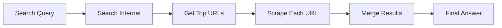

## Overview

SearchGraph is a powerful scraping pipeline that searches the internet for answers to a given prompt, scrapes the top results, and merges the information into a comprehensive answer. It combines web search with intelligent scraping.

## Features

- Automatic internet search based on your prompt
- Scrapes multiple search results automatically
- Merges information from multiple sources
- Configurable number of results to scrape
- Returns both the answer and list of URLs considered

## Parameters

The SearchGraph constructor accepts the following parameters:

```python
SearchGraph(
    prompt: str,              # Natural language search query
    config: dict,             # Configuration dictionary
    schema: Optional[BaseModel] = None  # Pydantic schema for structured output
)
```

<Note>
  Unlike SmartScraperGraph, SearchGraph does **not** require a `source` parameter. It automatically searches and finds relevant URLs.
</Note>

### Configuration Options

| Parameter | Type | Default | Description |
|-----------|------|---------|-------------|
| `llm` | dict | Required | LLM model configuration |
| `max_results` | int | `3` | Number of search results to scrape |
| `verbose` | bool | `False` | Enable detailed logging |
| `search_engine` | str | `"google"` | Search engine to use |
| `serper_api_key` | str | Optional | API key for Serper search engine |

## Usage Examples

<Tabs>
  <Tab title="OpenAI">
    ```python
    import os
    from dotenv import load_dotenv
    from scrapegraphai.graphs import SearchGraph

    load_dotenv()

    openai_key = os.getenv("OPENAI_API_KEY")

    graph_config = {
        "llm": {
            "api_key": openai_key,
            "model": "openai/gpt-4o",
        },
        "max_results": 2,
        "verbose": True,
    }

    # Create the SearchGraph instance
    search_graph = SearchGraph(
        prompt="List me Chioggia's famous dishes",
        config=graph_config
    )

    # Run the graph
    result = search_graph.run()
    print(result)

    # Get the URLs that were considered
    urls = search_graph.get_considered_urls()
    print("Scraped URLs:", urls)
    ```
  </Tab>
  <Tab title="Ollama">
    ```python
    from scrapegraphai.graphs import SearchGraph
    from scrapegraphai.utils import prettify_exec_info

    graph_config = {
        "llm": {
            "model": "ollama/llama3",
            "temperature": 0,
            "base_url": "http://localhost:11434",
        },
        "max_results": 5,
        "verbose": True,
    }

    # Create the SearchGraph instance
    search_graph = SearchGraph(
        prompt="List me the best escursions near Trento",
        config=graph_config
    )

    # Run the graph
    result = search_graph.run()
    print(result)

    # Get execution info
    graph_exec_info = search_graph.get_execution_info()
    print(prettify_exec_info(graph_exec_info))
    ```
  </Tab>
</Tabs>

## Schema-Based Extraction

Use Pydantic schemas to structure the merged output:

```python
from pydantic import BaseModel, Field
from typing import List

class Dish(BaseModel):
    name: str = Field(description="Dish name")
    description: str = Field(description="Dish description")
    ingredients: List[str] = Field(description="Main ingredients")

class DishList(BaseModel):
    dishes: List[Dish] = Field(description="List of famous dishes")

graph_config = {
    "llm": {
        "model": "openai/gpt-4o",
        "api_key": os.getenv("OPENAI_API_KEY"),
    },
    "max_results": 3,
}

search_graph = SearchGraph(
    prompt="What are Chioggia's famous dishes?",
    config=graph_config,
    schema=DishList
)

result = search_graph.run()
print(result)
```

## Getting Considered URLs

Retrieve the list of URLs that were scraped:

```python
search_graph = SearchGraph(
    prompt="Latest AI developments",
    config=graph_config
)

result = search_graph.run()

# Get the URLs that were considered during the search
urls = search_graph.get_considered_urls()
for url in urls:
    print(f"Scraped: {url}")
```

## Custom Search Engine

You can configure different search engines:

```python
graph_config = {
    "llm": {"model": "openai/gpt-4o"},
    "search_engine": "google",  # or "bing", "duckduckgo"
    "max_results": 5,
}
```

## Using Serper API

For more reliable search results, use the Serper API:

```python
import os

graph_config = {
    "llm": {
        "model": "openai/gpt-4o",
        "api_key": os.getenv("OPENAI_API_KEY"),
    },
    "serper_api_key": os.getenv("SERPER_API_KEY"),
    "max_results": 3,
}

search_graph = SearchGraph(
    prompt="Best practices for Python web scraping",
    config=graph_config
)
```

## Output Format

The `run()` method returns a merged answer from all scraped sources:

```python
result = search_graph.run()
# Returns: Dictionary with merged information from multiple sources

urls = search_graph.get_considered_urls()
# Returns: List[str] of URLs that were scraped
```

## How It Works

1. **Search**: The graph searches the internet based on your prompt
2. **Scrape**: Top results (configured by `max_results`) are scraped using SmartScraperGraph
3. **Merge**: Information from all sources is intelligently merged into a single answer



## Example Output

```python
search_graph = SearchGraph(
    prompt="What are the health benefits of green tea?",
    config=graph_config
)

result = search_graph.run()

# Example output:
# {
#   "benefits": [
#     "Rich in antioxidants",
#     "May improve brain function",
#     "Increases fat burning",
#     "May reduce risk of certain cancers"
#   ],
#   "sources": 3
# }

urls = search_graph.get_considered_urls()
# ["https://healthline.com/...", "https://medicalnewstoday.com/...", ...]
```

## Performance Tips

<Warning>
  - Setting `max_results` too high will increase execution time significantly
  - Each result is scraped individually using SmartScraperGraph
  - Recommended `max_results`: 2-5 for optimal performance
</Warning>

<Note>
  - Use `verbose=True` to monitor which URLs are being scraped
  - The graph automatically filters out low-quality or inaccessible URLs
  - Merging happens at the end, combining information from all sources
</Note>

## Error Handling

```python
try:
    result = search_graph.run()
    if result:
        print("Search successful:", result)
        print(f"Scraped {len(search_graph.get_considered_urls())} URLs")
    else:
        print("No results found")
except Exception as e:
    print(f"Error during search: {e}")
```

## Related Graphs

<CardGroup cols={2}>
  <Card title="SmartScraperGraph" icon="brain" href="/graphs/smart-scraper">
    Scrape a known URL
  </Card>
  <Card title="SmartScraperMultiGraph" icon="layer-group" href="/graphs/multi-scraper">
    Scrape multiple known URLs
  </Card>
</CardGroup>