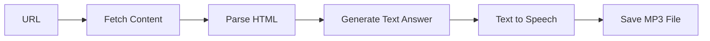

## Overview

SpeechGraph is a unique scraping pipeline that combines web scraping with text-to-speech conversion. It scrapes a web page, generates a text answer to your prompt, and then converts that answer into an audio file.

## Features

- Scrape and summarize web content
- Automatic text-to-speech conversion
- Customizable voice and audio settings
- Save audio in MP3 format
- Powered by OpenAI's TTS models

<Warning>
  SpeechGraph requires **OpenAI API** and uses the `tts-1` model. Ollama and other local models are not supported for audio generation.
</Warning>

## Parameters

The SpeechGraph constructor accepts the following parameters:

```python
SpeechGraph(
    prompt: str,              # Natural language description of what to extract
    source: str,              # URL or path to local HTML file
    config: dict,             # Configuration dictionary
    schema: Optional[BaseModel] = None  # Pydantic schema for structured output
)
```

### Configuration Options

| Parameter | Type | Default | Description |
|-----------|------|---------|-------------|
| `llm` | dict | Required | LLM model configuration (OpenAI) |
| `tts_model` | dict | Required | Text-to-speech model configuration |
| `output_path` | str | `"output.mp3"` | Path where audio file will be saved |
| `verbose` | bool | `False` | Enable detailed logging |
| `headless` | bool | `True` | Run browser in headless mode |

## Usage Example

```python
import os
from dotenv import load_dotenv
from scrapegraphai.graphs import SpeechGraph
from scrapegraphai.utils import prettify_exec_info

load_dotenv()

# Define audio output path
FILE_NAME = "website_summary.mp3"
curr_dir = os.path.dirname(os.path.realpath(__file__))
output_path = os.path.join(curr_dir, FILE_NAME)

# Define the configuration
openai_key = os.getenv("OPENAI_API_KEY")

graph_config = {
    "llm": {
        "api_key": openai_key,
        "model": "openai/gpt-4o",
        "temperature": 0.7,
    },
    "tts_model": {
        "api_key": openai_key,
        "model": "tts-1",
        "voice": "alloy"  # Options: alloy, echo, fable, onyx, nova, shimmer
    },
    "output_path": output_path,
}

# Create the SpeechGraph instance
speech_graph = SpeechGraph(
    prompt="Make a detailed audio summary of the projects.",
    source="https://perinim.github.io/projects/",
    config=graph_config,
)

# Run the graph
result = speech_graph.run()
print(result)  # Prints the text that was converted to speech

# Get execution info
graph_exec_info = speech_graph.get_execution_info()
print(prettify_exec_info(graph_exec_info))
```

## Voice Options

OpenAI TTS offers 6 different voices:

| Voice | Description | Best For |
|-------|-------------|----------|
| `alloy` | Neutral, balanced | General purpose |
| `echo` | Male, clear | Professional content |
| `fable` | British, expressive | Storytelling |
| `onyx` | Deep, authoritative | News, announcements |
| `nova` | Female, warm | Friendly content |
| `shimmer` | Soft, gentle | Calm narration |

```python
graph_config = {
    "llm": {"api_key": openai_key, "model": "openai/gpt-4o"},
    "tts_model": {
        "api_key": openai_key,
        "model": "tts-1",
        "voice": "nova"  # Choose your preferred voice
    },
    "output_path": "output.mp3",
}
```

## TTS Models

OpenAI offers two TTS models:

- **`tts-1`**: Optimized for speed (recommended)
- **`tts-1-hd`**: Higher quality but slower

```python
"tts_model": {
    "api_key": openai_key,
    "model": "tts-1-hd",  # Use HD for higher quality
    "voice": "alloy"
}
```

## Custom Output Path

Specify where to save the generated audio file:

```python
import os

# Save in current directory
output_path = os.path.join(os.getcwd(), "my_summary.mp3")

# Save in specific directory
output_path = "/path/to/audio/summary.mp3"

graph_config = {
    "llm": {"api_key": openai_key, "model": "openai/gpt-4o"},
    "tts_model": {"api_key": openai_key, "model": "tts-1", "voice": "alloy"},
    "output_path": output_path,
}
```

## How It Works

1. **Fetch**: Downloads the web page content
2. **Parse**: Parses HTML into structured text
3. **Generate**: Creates text answer based on your prompt
4. **Convert**: Converts text to speech using OpenAI TTS
5. **Save**: Saves audio file to specified path



## Output Format

The `run()` method returns the text content that was converted to speech:

```python
result = speech_graph.run()
# Returns: String containing the text summary
# Side effect: Saves audio file to output_path

print(result)  # The text that was converted
# Audio file saved at: output_path
```

## Example: Podcast Summary

```python
graph_config = {
    "llm": {
        "api_key": os.getenv("OPENAI_API_KEY"),
        "model": "openai/gpt-4o",
        "temperature": 0.8,  # More creative
    },
    "tts_model": {
        "api_key": os.getenv("OPENAI_API_KEY"),
        "model": "tts-1",
        "voice": "echo"  # Professional male voice
    },
    "output_path": "podcast_summary.mp3",
}

speech_graph = SpeechGraph(
    prompt="Create an engaging podcast-style summary of this article, highlighting the key insights and why they matter.",
    source="https://example.com/article",
    config=graph_config,
)

result = speech_graph.run()
print(f"Audio saved! Duration: ~{len(result.split())/150:.1f} minutes")
```

## Error Handling

```python
try:
    result = speech_graph.run()
    if result:
        print("Audio generated successfully!")
        print(f"Text: {result}")
        print(f"Audio saved to: {graph_config['output_path']}")
    else:
        print("No content generated")
except ValueError as e:
    print(f"Audio generation error: {e}")
except Exception as e:
    print(f"Error during scraping: {e}")
```

## Performance and Costs

<Note>
  **Cost Considerations:**
  - OpenAI GPT-4: ~$0.01-0.03 per request (depending on content length)
  - OpenAI TTS: ~$0.015 per 1,000 characters
  - Average article: $0.02-0.10 total cost
</Note>

<Warning>
  **Audio Quality:**
  - `tts-1`: Good quality, fast generation (~1 second per 1,000 characters)
  - `tts-1-hd`: Better quality, slower (~2-3 seconds per 1,000 characters)
</Warning>

## Use Cases

- **Content Accessibility**: Convert articles to audio for visually impaired users
- **Commuting**: Create audio summaries for listening while driving
- **Learning**: Generate audio study materials from documentation
- **Podcasting**: Create audio content from written sources
- **News Briefings**: Daily audio summaries of news articles

## Local HTML Files

You can also convert local HTML files to audio:

```python
speech_graph = SpeechGraph(
    prompt="Summarize this document in an engaging way",
    source="/path/to/local/document.html",
    config=graph_config,
)

result = speech_graph.run()
```

## Related Graphs

<CardGroup cols={2}>
  <Card title="SmartScraperGraph" icon="brain" href="/graphs/smart-scraper">
    Text-only scraping without audio
  </Card>
  <Card title="OmniScraperGraph" icon="images" href="/graphs/omni-scraper">
    Scrape with image analysis
  </Card>
</CardGroup>